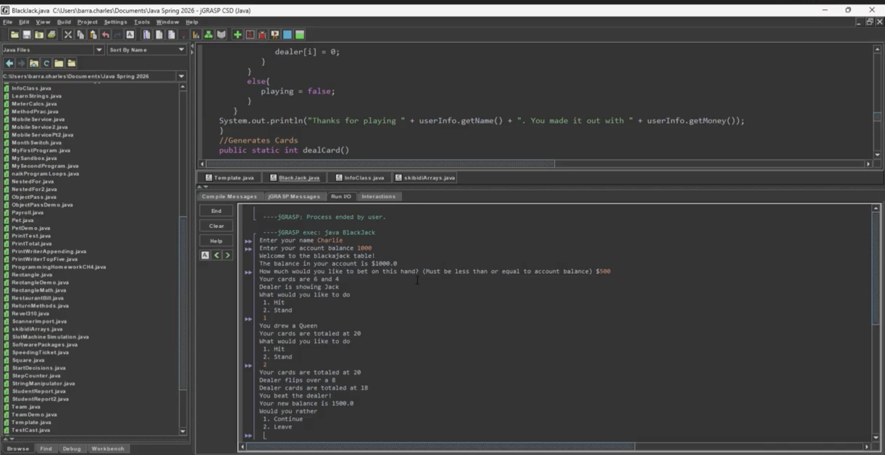

# Blackjack Program

A Java console version of Blackjack with betting, card draws, dealer behavior, and win-state checking.

[View my programming portfolio](https://www.charliebarra.com/programming.html)



## The Question

How do you turn rules that people understand at a card table into rules a computer can check every time?

## What I Built

I built a console Blackjack game that asks for a player name and account balance, accepts a bet, deals cards, lets the player hit or stand, and runs the dealer's turn. It then checks the possible win, loss, bust, and tie states before updating the balance and asking whether to play again.

Losing to the dealer was probably funnier than it should have been.

## How It Works

- Arrays store the player's and dealer's cards.
- Random numbers represent card draws and are converted to readable card values.
- Helper methods deal cards, translate card values, and total a hand.
- Aces can count as 11 or be reduced to 1 when a hand would otherwise bust.
- Loops control player hits, dealer draws below 17, and replaying.
- Conditional checks resolve busts, wins, losses, and ties.
- A companion `InfoClass` is referenced for the player's name and account balance.

## Something That Surprised Me

Checking the win states took the longest. Blackjack feels simple while people are playing it, but the code has to handle every combination in the right order. I also had a bug where a card would not draw correctly. That made the dealing logic a lot less automatic than it looked from the outside.

## What I Would Change Next

I would add visuals so the cards and table are visible instead of showing the whole game as console text.

## Run It

### Important archive note

The original archive includes `BlackJack.java` and its compiled `BlackJack.class`, but it does **not** include the companion `InfoClass.java` or `InfoClass.class` referenced by the program. The screenshot also shows that `InfoClass.java` existed in the original project.

Because that dependency is missing, this repository is preserved as evidence of the original work but cannot be freshly compiled or run as a standalone project yet. Once the original `InfoClass` source is recovered, the expected commands are:

```bash
javac src/BlackJack.java src/InfoClass.java
java -cp src BlackJack
```

I am not reconstructing the missing class from memory because that would no longer be the original project.

## Files

- `src/BlackJack.java` — original Java source, preserved unchanged
- `src/BlackJack.class` — original compiled class, preserved unchanged
- `images/blackjack-screenshot.png` — original run screenshot
- `SOURCE-INTEGRITY.md` — checksums for verifying both original files

## Source Integrity

The supplied Java files are intentionally unchanged, including the variable names. Yes, the Scanners are really named `gorlockTheEaterOfInts` and `gorlockTheEaterOfStrings`.

## Repository Context

This repository was assembled in July 2026 from original project files for portfolio review. Its Git history records archival organization and later documentation updates, not the project's original development timeline. The Java source, compiled class, and screenshot are preserved from the supplied original project materials; `SOURCE-INTEGRITY.md` records their checksums.
